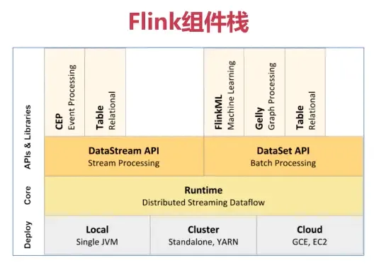
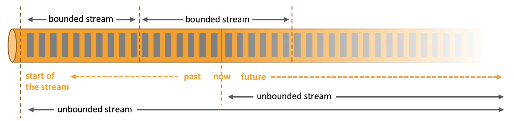
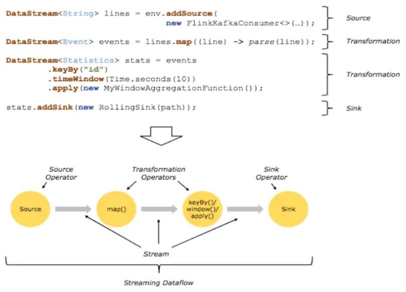
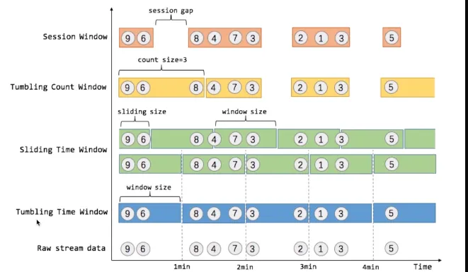
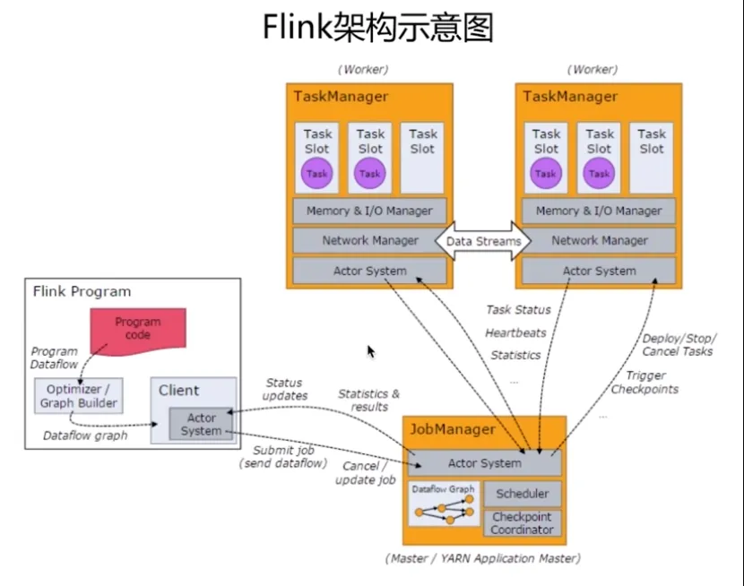

# 1. 简介
   a. Flink是一个框架和分布式处理引擎，用于在无界和有界数据流上进行有状态的计算

   b. Flink被设计为在所有常见的集群环境中运行，以内存中的速度和任何规模执行计算

## 1.1 Flink 分层架构

### Deployment层
涉及Flink的部署模式，本地模式、集群模式（Standalone/YARN）、云。生产环境中主要为YARN模式。
### RunTime层
提供了支持Flink计算的全部核心实现，例如：支持分布式的Stream处理、调度策略等，为上层API服务。
### API层
实现面向无界Stream的流处理和面向Batch的批处理API，分别为DataStream API和DataSet API。
### Libaries层
在API层之上构建的满足特定应用的实现计算框架，分别用于面向流处理和批处理。
CEP面向事件，Table用于类SQL，FlinkML用于机器学习，Gelly为图处理。

## 1.2 流与批的世界观

- 批处理的特点是有界、持久、大量，非常适合需要访问全套记录才能完成的计算工作，一般用于离线统计。

- 流处理的特点是无界、实时, 无需针对整个数据集执行操作，而是对通过系统传输的每个数据项执行操作，一般用于实时统计。
- 在 spark 的世界观中，一切都是由批次组成的，离线数据是一个大批次，而实时数据是由一个一个无限的小批次组成的。
- 而在 flink 的世界观中，一切都是由流组成的，离线数据是有界限的流，实时数据是一个没有界限的流，这就是所谓的有界流和无界流。
- 无界数据流：无界数据流有一个开始但是没有结束，它们不会在生成时终止并提供数据，必须连续处理无界流，也就是说必须在获取后立即处理 event。对于无界数据流我们无法等待所有数据都到达，因为输入是无界的，并且在任何时间点都不会完成。处理无界数据通常要求以特定顺序（例如事件发生的顺序）获取 event，以便能够推断结果完整性。
- 有界数据流：有界数据流有明确定义的开始和结束，可以在执行任何计算之前通过获取所有数据来处理有界流，处理有界流不需要有序获取，因为可以始终对有界数据集进行排序，有界流的处理也称为批处理。
- 流处理一般支持低延迟、Exactly-once保证（仅用一次）
- 批处理则是需要支持高吞吐、高效处理。
- Flink完全支持流处理，作为流处理看待时输入数据流是无界的；批处理被作为一种特殊的流处理，其输入数据流有界。

## 1.3 基本概念和基本架构

### 1.3.1基本概念

Flink程序的基础构建模块是流（Streams）和转换（transformations）。流就是数据的输入，转换是对数据的操作。每个流都起始于一个或多个source，并终止于一个sink

- 流上的聚合需要由窗口来划定范围，比如时间区间和数量的序号范围等
  ○ 窗口分为多个类型
    ■ 滚动窗口（没有数据重叠）
    ■ 滑动窗口（有数据重叠）
    ■ 会话窗口（由不活动的间隙打断）

  上图中的sliding size 是滑动窗口在滑动过程中的时间间隔。
滚动窗口有滚动时间窗口和滚动数据窗口，前者划定一段时间内的数据，后者等待数据规模到达阈值。

### 1.3.2 基本架构
Flink是基于Master-Slave风格的架构
其启动时会启动JobManager进程和至少一个TaskManager进程

#### JobManager
系统的协调者，负责接收Job，调度组成Job的多个Task的执行。
收集Job的状态信息，管理从节点TaskManager。
#### TaskManager
实际负责执行计算的工作节点，在其上执行Task。
TaskManager负责管理其所在节点上的资源信息，并在启动时将这些信息向JobManager汇报。
#### Client
用户提交Flink程序的时候，会先创建一个Client，该Client对提交的程序进行预处理后在提交到Flink集群。
Client会将用户提交的Flink程序组成一个JobGraph，并以这种形式提交。

### 1.4 编程模型
